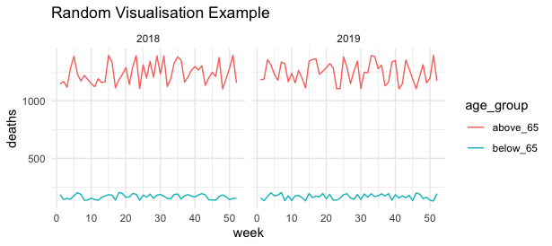
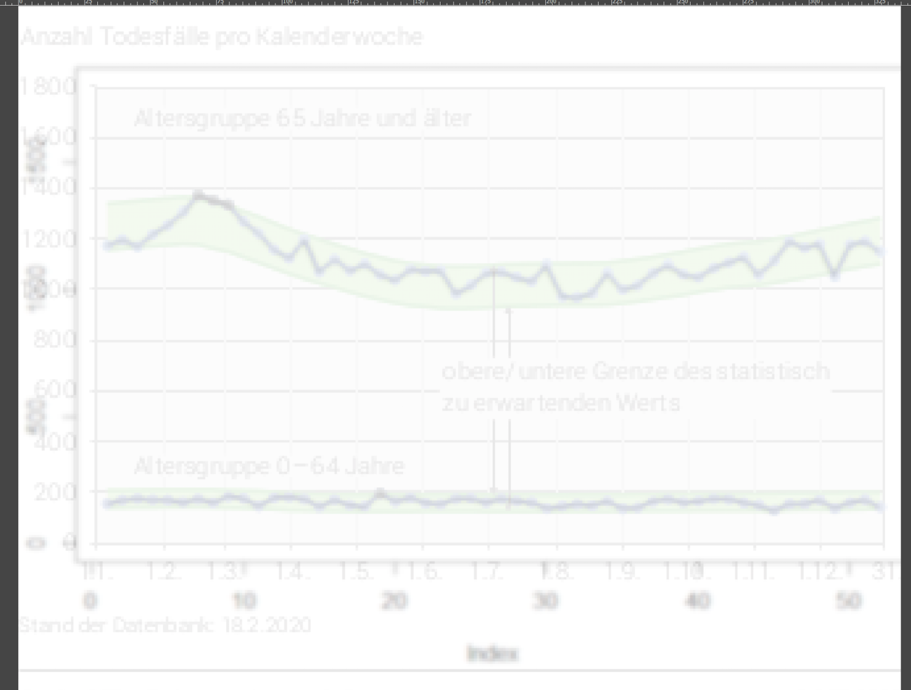

# covid19monitoring_health_mortality - inofficial machine readable dataset

The original data are published by the Swiss Federal Statistical Office (FSO) here: 
https://www.bfs.admin.ch/bfs/de/home/statistiken/gesundheit/gesundheitszustand/sterblichkeit-todesursachen.html

Methodological comments:
https://www.bfs.admin.ch/bfs/en/home/statistics/health/state-health/mortality-causes-death.assetdetail.12547462.html

This project extracts data from the graphs of the original publication in order to facilitate analysis and scientific research by providing **machine readable information**. This repository contains **machine readable information** on the **weekly number of deaths in Switzerland** for all completed years from **2013-2019** and **parts of 2020**. We are also making an effort to deliver updates when the 2020 data are updated by its original provider. 

**Please use this inoffical dataset carefully and verify your conclusions and publications by comparing them to the original source! Note also that our extraction is an approximation:** Hence we **floored** all numbers as we assumed statistics were absolute reported numbers.

We do our best to make our effort transparent and reproducible. The below sections will describe the datasets created by our extraction as well as how to reproduce the extraction procedure.

## Dataset Description

Simply download .csv datasets from the [data/](https://github.com/statistikZH/covid19monitoring_health_mortality/tree/master/data) folder of this repository. Github newbies: Please note github renders .csv files, so if you just want the data w/o looking at it online, switch to Raw before downloading, e.g., [2019.csv raw](https://raw.githubusercontent.com/statistikZH/covid19monitoring_health_mortality/master/data/2019.csv).  There is one .csv file per year. 
All data are available as long format .csv files. The dimensions are: **year, week, age_group**. The value column is 
simply called **deaths**. 

**Visualisation Suggestion Based in Random data**




```r
d_b65_2018 <- data.frame(
  year = rep(2018,52),
  week = 1:52,
  age_group = 'below_65',
  deaths = floor(runif(52, 130, 205))
)

d_a65_2018 <- data.frame(
  year = rep(2018,52),
  week = 1:52,
  age_group = 'above_65',
  deaths = floor(runif(52, 1100, 1400))
)

d_b65_2019 <- data.frame(
  year = rep(2019,52),
  week = 1:52,
  age_group = 'below_65',
  deaths = floor(runif(52, 130, 205))
)

d_a65_2019 <- data.frame(
  year = rep(2019,52),
  week = 1:52,
  age_group = 'above_65',
  deaths = floor(runif(52, 1100, 1400))
)

d <- rbind(d_a65_2018,d_b65_2018,d_b65_2019,d_a65_2019)

library(ggplot2)
gg <- ggplot(data = d,
             aes(x = week, y = deaths,
                 color = age_group))
gg + geom_line() +
  theme_minimal() + 
  ggtitle("Random Visualisation Example") +
  facet_wrap(~year)

```


## Reproduce Data Extraction

The below sections describe our steps from .pdf to .csv. You will need the [R Language for Statistical Computing](https://www.r-project.org/) and [pdf2svg](https://github.com/dawbarton/pdf2svg) to reproduce the extraction process. 


The chart above shows an overlay created in Gimp. A chart generated with base R is put above the original graph with reduced opacity, so the image is transparent enough to see the original FSO graph. As you can see our approximation
is pretty neat. The difference between the lines is hard to spot. 


1. Download .pdf for years 2013-2020 from the table at the bottom of the [FSO page](https://www.bfs.admin.ch/bfs/de/home/statistiken/gesundheit/gesundheitszustand/sterblichkeit-todesursachen.html)

2. Use the command line tool [pdf2svg](https://github.com/dawbarton/pdf2svg) to convert the .pdf files into SVGs. The tools is available on Windows as well as for OSX and Linux. We recommend to compile the program on our own for OSX and Linux, for Windows we recommend to use the binary provided by the author of the package. 

```
pdf2svg input.pdf output.svg
```

3. We have create a little R package to read in the SVG generated by pdf2svg. Install the {chmortality} R package from github. The easiest way to do is via the {remotes} R package. This may also install our imports the {data.table} and {xml2} R packages. 

```
remotes::install_github("statistikZH/covid19monitoring_health_mortality")
```

4. Run the following code 

```r
library(chmortality)
out <- extract_data("path_to_2019_svg")
fwrite(out, file = "data_2019.csv")


```


